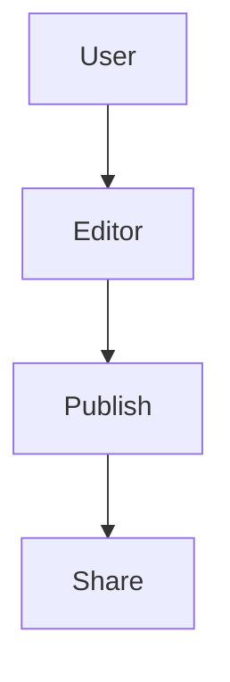

## Overview

Wesley N provides a comprehensive suite of tools for creating, organizing, and collaborating on project documentation. You get intuitive workflows for page management, flexible folder structures, real-time collaboration features, powerful search capabilities, and robust media support. These features ensure your docs stay organized and accessible.

<Columns cols={3}>
  <Card title="Page Workflows" icon="edit-3" href="#page-creation">
    Streamlined creation and editing.
  </Card>
  <Card title="Organization" icon="folder" href="#organization">
    Folders and advanced structuring.
  </Card>
  <Card title="Collaboration" icon="users" href="#collaboration">
    Share and work together seamlessly.
  </Card>
</Columns>

## Page Creation and Editing Workflows

Create new pages instantly from the dashboard or within folders. Editing supports rich text, markdown, and MDX components for dynamic content.

<Steps>
  <Step title="Create Page" icon="plus">
    Click the `+ New Page` button in the sidebar.

    Select a template like "Blank" or "API Reference".
  </Step>
  <Step title="Edit Content" icon="edit">
    Use the visual editor for WYSIWYG changes.

````markdown
# Welcome to Wesley N

Add your content here.
````

  </Step>
  <Step title="Publish" icon="upload">
    Hit `Publish` to make it live.

    Changes sync in real-time for collaborators.
  </Step>
</Steps>

<Callout kind="tip">
  Use keyboard shortcuts like `Cmd+K` for quick search during editing.
</Callout>

## Folder Structures and Organization Methods

Organize docs with nested folders, tags, and custom hierarchies. Folders support unlimited nesting for complex projects.

<Tabs>
  <Tab title="Folders" icon="folder">
    Drag and drop pages into folders.

    ```
    /docs
    ├── /api
    │   ├── endpoints.mdx
    │   └── auth.mdx
    └── /guides
        └── quickstart.mdx
    ```
  </Tab>
  <Tab title="Tags" icon="tag">
    Assign multiple tags like `feature`, `bugfix`.

    Filter views by tag combinations.
  </Tab>
</Tabs>

## Collaboration and Sharing Options

Invite team members with granular permissions. Share public links or embed pages externally.

<ExpandableGroup>
  <Expandable title="Invite Collaborators" default-open="true">
    Go to `Settings > Sharing`.

    Add emails and set roles: Viewer, Editor, Admin.

    | Role    | Can View | Can Edit | Can Manage |
    |---------|----------|----------|------------|
    | Viewer  | ✅       | ❌       | ❌        |
    | Editor  | ✅       | ✅       | ❌        |
    | Admin   | ✅       | ✅       | ✅        |
  </Expandable>
  <Expandable title="Public Sharing">
    Generate shareable links with optional passwords.

    Embed code:

````html
<iframe src="https://docs.wesleyn.com/embed/project/abc123" width="100%" height="600"></iframe>
````

  </Expandable>
</ExpandableGroup>

## Search and Filtering Functionalities

Search across all pages with full-text indexing. Filter by folders, tags, or dates.

| Filter Type | Example Query          | Matches                  |
|-------------|------------------------|--------------------------|
| Text        | `authentication`       | All pages with term      |
| Folder      | `folder:api`           | Pages in `/api` folder   |
| Tag         | `tag:feature`          | Feature-tagged pages     |
| Date        | `updated:>2024-01-01`  | Recently updated pages   |

<Callout kind="info">
  Advanced search supports boolean operators like `auth AND api`.
</Callout>

## Media and Embed Support

Embed images, videos, diagrams, and third-party content directly.

<CodeGroup tabs="Image,Mermaid,Video">
```markdown

```

```html
<Video src="https://youtube.com/embed/demo" width="560" height="315" />
```
</CodeGroup>

Use these features to build professional, interactive documentation that scales with your project.